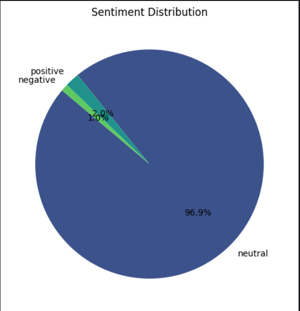

```markdown
# Google Trends and Twitter Sentiment Analysis

## Overview
This project utilizes **Google Trends** and the **Twitter API** to collect real-time trending data and perform sentiment analysis on social media discussions. The analysis pipeline includes data scraping, preprocessing, sentiment analysis, and visualization of trends, sentiments, and actionable insights.

---

## Project Workflow

1. **Google Trends Data Collection:**
   - Use **Google Trends API** to fetch trending keywords in India, including interest over time and related queries.
   - The project collects and saves trending data to CSV files.

2. **Twitter Data Scraping:**
   - Use the **Twitter API** to scrape data related to the trends obtained from Google Trends.
   - Collect Twitter posts and comments for the identified trends.

3. **Data Preprocessing:**
   - **Text Cleaning:** Removal of unwanted symbols, punctuation, and stop words.
   - **Language Detection:** Identify and remove non-English text.
   - **Stemming & Lemmatization:** Normalize words by stemming and lemmatizing.
   - **Spelling Correction:** Correct spelling errors to enhance text quality.

4. **Sentiment Analysis:**
   - Utilize a **sentiment analysis pipeline** to classify posts and comments as positive, negative, or neutral.
   - Perform sentiment classification using pre-trained models.

5. **Data Visualization:**
   - Visualize sentiment distribution using **pie charts** or **bar graphs** to represent the percentage of positive, negative, and neutral sentiments.
   - Generate trend reports and insights based on sentiment distribution.

---

## Features

- **Trending Data Collection:** Get the latest trends from Google Trends for a specific region (India in this case).
- **Twitter Data Scraping:** Automatically fetch real-time data from Twitter related to trending keywords.
- **Data Preprocessing:** Clean and prepare data for analysis by removing noise and normalizing text.
- **Sentiment Analysis:** Classify tweets into positive, negative, or neutral categories based on sentiment.
- **Visualization:** Display sentiment distributions and trends visually for easy interpretation.

---

## Requirements

### Python Libraries:
- `pytrends`: To interact with Google Trends API.
- `tweepy`: To interact with Twitter API.
- `requests`: To fetch additional information (e.g., Wikipedia summaries).
- `pandas`: For data manipulation.
- `nltk`: For natural language processing tasks like stemming and stop words removal.
- `sklearn`: For machine learning models, if any.
- `matplotlib` & `seaborn`: For data visualization.
- `transformers`: For utilizing pre-trained sentiment analysis models (like BERT, RoBERTa).

To install the required libraries, you can run:
```bash
pip install pytrends tweepy requests pandas nltk sklearn matplotlib seaborn transformers
```

---

## How to Use

1. **Clone the repository:**
   ```bash
   git clone https://github.com/your-username/google-trends-twitter-sentiment-analysis.git
   ```

2. **Set up Twitter API keys:**
   - Create a Twitter Developer account and obtain the API keys (API Key, API Secret Key, Access Token, and Access Token Secret).
   - Store the keys in a `.env` file or directly in the script.

3. **Run the notebook or Python scripts:**
   - Execute the script to fetch the data, preprocess it, perform sentiment analysis, and visualize the results.

4. **Generated Files:**
   - The program generates the following CSV files:
     - `interest_over_time_india.csv`: Google Trends interest over time data.
     - `trending_searches_india.csv`: Current trending searches in India.
     - `trending_searches_with_details_india.csv`: Top 10 trending searches with additional information.
   
---

## Visualizations

The project generates the following visualizations to represent the sentiment distribution of tweets:

- **Pie chart** showing the percentage of positive, negative, and neutral sentiments.
- **Bar graph** depicting sentiment distribution over time for trending topics.

Example visualization:


---

## Future Improvements

1. **Real-Time Updates:** Integrate with a real-time API to track trends and sentiments continuously.
2. **Dashboard:** Create an interactive dashboard for better data exploration and visualization.
3. **Prediction Model:** Build a predictive model to forecast future trends or sentiment shifts based on historical data.
4. **Geographical Insights:** Extend the project to analyze trends and sentiment based on geographic regions within India or globally.

---

## Contributing

We welcome contributions! If you have any improvements, feel free to fork the repository and submit a pull request.


---

## Acknowledgements

- **Google Trends API:** For providing access to trending data.
- **Twitter API:** For providing access to social media data.
- **Hugging Face Transformers:** For providing state-of-the-art pre-trained models.
- **matplotlib and seaborn:** For creating beautiful visualizations.

```

---

### **Instructions for the `README.md` file:**

1. **Introduction and Overview:** 
   - Provides a general description of the project and its purpose.

2. **Project Workflow:** 
   - Step-by-step explanation of how the data is fetched, processed, and analyzed.

3. **Features:** 
   - Highlights the main features and functionality of the project.

4. **Requirements:** 
   - Lists the required libraries and tools necessary to run the project.

5. **Usage Instructions:** 
   - Details how to clone, set up, and run the project.

6. **Visualizations:** 
   - Describes the types of visualizations produced and includes an example image.

7. **Future Improvements:** 
   - Suggestions on how to extend the project.

8. **Contributing:** 
   - Encourages other developers to contribute to the project.

9. **License:** 
   - Information about the license governing the project.

10. **Acknowledgements:** 
   - Credits to external tools, APIs, and libraries used in the project.

---

This `README.md` provides a comprehensive explanation of your project, making it easy for others to understand and use it. You can also modify it based on any further updates or changes in your project.
